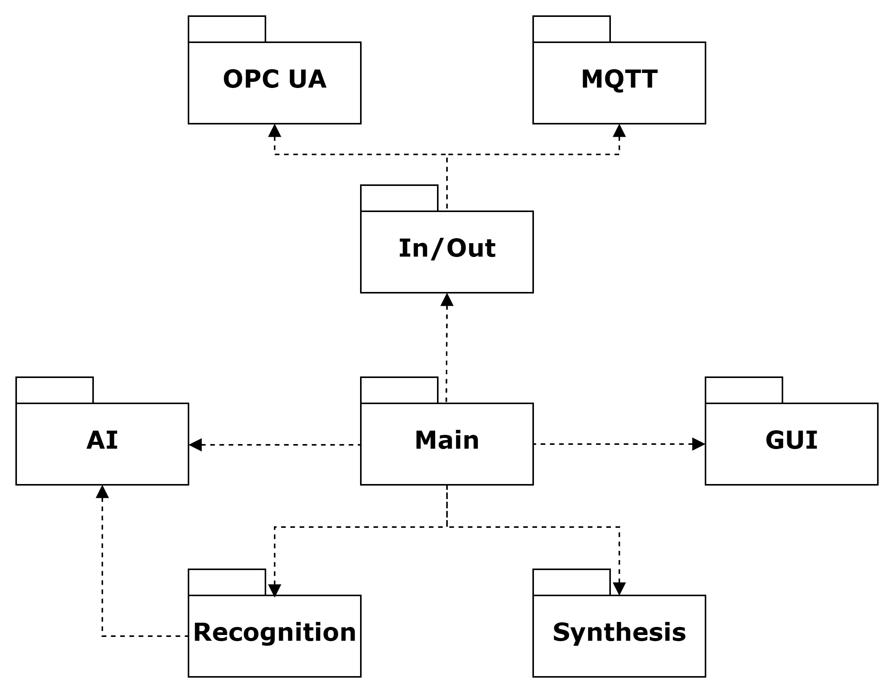

# Redefining Human-Machine Collaboration: Industry 5.0 to Improve Safety and Efficiency

## Project Overview

This project showcases the development and implementation of an advanced AI-powered voice assistant designed for use in an Industry 5.0 manufacturing environment, specifically a window production line. The assistant enhances operational efficiency, improves access to real-time data, and facilitates hands-free interaction for operators.

## Table of Contents

1. [Features](#features)
2. [System Architecture](#system-architecture)
3. [Implementation](#implementation)
4. [Performance Results](#performance-results)
5. [Future Improvements](#future-improvements)
6. [How to Load and Compile the Project from GitHub](#how-to-load-and-compile-the-project-from-github)
7. [Authors](#authors)

## Features

- **Natural Language Processing**: Utilizes OpenAI's GPT models for advanced language understanding and generation.
- **Speech Recognition**: Converts spoken commands into text for processing.
- **Text-to-Speech Synthesis**: Provides auditory feedback, ideal for hands-free operation.
- **Real-time Data Access**: Connects to production line systems for immediate information retrieval.
- **Hands-free Operation**: Allows operators to interact with the system while performing tasks.
- **Adaptive Learning**: Quickly adapts to new manuals and technical documentation.

## System Architecture

The voice assistant is built on a modular architecture:



The project consists of several modules and files that make up the automation system, including a robotic cell and a generative AI-based virtual assistant:

- `main.py` Main controller module that integrates voice recognition, ChatGPT interaction, and speech synthesis.
- `reconocimiento.py` Handles voice recognition using Google Speech Recognition.
- `sintesis.py` Converts text into speech using GTTS or ChatGPT’s text-to-speech service.
- `chatGPT.py` Manages the connection and communication with ChatGPT, processes queries, and handles file uploads.
- `IG.py` GUI module that displays the chat dialog and manages user input.
- `EyS.py` Handles input/output logic, enabling the selection of real-time data sources.
- `globalC.py` Provides MQTT functionality, subscribing to topics and handling real-time communication between devices.
- `localC.py` Implements OPC UA communication for retrieving operational data and ensuring real-time interoperability with industrial control systems.
- `variablesG.py` Defines global variables and shared events across the system for consistent behavior.
- `json_Hilos.py` Manages configuration and data storage using JSON files.

The system uses industrial protocols like OPC UA and MQTT with Sparkplug for interoperability and security. The voice assistant is designed to be scalable and adaptable to different manufacturing environments.


The following image represents the program's thread functionality, illustrating concurrency and parallelism in executing different tasks:


### Description of Threads

1. **Audio Analysis Thread**: Processes and analyzes the captured audio to check for relevant commands.
2. **Audio Detection**: Detects the wake word and sends the audio for the audio analysis thread.
3. **Message Sampling Thread for the Graphical Interface (GUI)**: Extracts and displays real-time messages in the user interface.
4. **Main Thread**: Manages the launch of the graphical interface and coordinates general system interactions.
5. **System Connection and Data Generation Thread**: Continuously reads the system status through industrial protocols such as OPC UA or MQTT.
6. **Data Generation and Shared Variable Storage Thread**: Saves the system status in a shared variable, allowing other threads to access this information.

Each of these threads operates in parallel to ensure a fast and efficient response from the voice assistant in industrial environments.

## Implementation

1. **Network Infrastructure**: Utilizes existing Schirmer production line network, supporting real-time communication.
2. **User Interface**: Custom-designed GUI with a chat-style dialog box for efficient operator interaction.
3. **Voice Activation**: Implements a wake word to distinguish between actual commands and background noise.
4. **Cloud Integration**: Leverages cloud technologies for efficient processing of large data volumes.

## Performance Results

Performance evaluation across various conditions:

| Condition | Accuracy (%) | Processing Time (s) |
|-----------|--------------|---------------------|
| Neutral Accent | 98.6 - 100.0 | 1.031 - 1.216 |
| Fast Speech | 88.2 - 100.0 | 0.935 - 1.436 |
| Normal Speech | 98.6 - 100.0 | 1.399 - 1.698 |
| Slow Speech | 88.6 - 100.0 | 0.936 - 1.497 |
| Low Background Noise | 98.6 - 100.0 | 0.809 - 1.458 |
| Medium Background Noise | 98.6 - 100.0 | 0.894 - 1.668 |
| High Background Noise | 93.2 - 97.6 | 1.019 - 1.704 |
| Simple Instructions | 98.6 - 100.0 | 0.492 - 0.869 |
| Complex Instructions | 97.2 - 97.4 | 1.864 - 2.404 |
| Interruptions | 93.6 | 1.648 |
| Tone Variation | 92.6 | 2.029 |

User satisfaction results:

- Satisfaction with the virtual assistant: 9.22/10
- Correct response generation rate: 7.62/10
- Ease of use: 7.34/10

## Future Improvements

1. Enhance noise cancellation for better performance in high-noise environments.
2. Implement more advanced natural language understanding for complex queries.
3. Integrate with wearable devices for improved hands-free operation.
4. Develop industry-specific language models for more accurate responses.
5. Implement multi-language support for diverse workforce environments.

## How to Load and Compile the Project from GitHub

To run the project on your local machine, follow these steps:

### 1. Clone the Repository

First, download the project from GitHub using the following command:

```bash
git clone https://github.com/Darknar/IEEE-AI-Voice-Assistant-for-Safer-Smarter-Industry-5.0-Manufacturing.git

cd IEEE-AI-Voice-Assistant-for-Safer-Smarter-Industry-5.0-Manufacturing
```

### 2. Install Dependencies

Ensure you have all required dependencies installed. Run:

```bash
pip install -r requirements.txt
```

### 3. Add Your ChatGPT API Key

This project requires an OpenAI API key for text generation. You need to add your API key inside the `config.json` file under the `APIKEY` field.

Open `config.json` and modify the following section:

```json
{
    "APIKEY": "your_api_key_here"
}
```

Replace `"your_api_key_here"` with your actual OpenAI API key.

### 4. Run the Program

Start the voice assistant with:

```bash
python main.py
```

This will initialize all required threads and allow the system to function as an industrial voice assistant.

---

## Authors

This project was developed by:

- *Francisco Antonio Lloret Abrisqueta* Industrial and Automatic Electronic Engineer from the Technical University of Cartagena (UPCT). Currently pursuing a Ph.D. in Industrial Technologies, focusing on artificial intelligence and digital twins for predictive maintenance and manufacturing optimization.

- *Antonio Guerrero Gonzalez* Associate Professor of Automation and Electrical Engineering and Vice-Rector for Students and Employment at UPCT. His research focuses on Industry 4.0, including autonomous systems, collaborative robotics, and AI for industrial automation. He has led several publicly and privately funded projects.

- *Roberto Zapata Martinez* Industrial and Automatic Electronic Engineer from UPCT and a current Master’s student in Industry 4.0. His interests include collaborative robotics, autonomous systems, and advanced simulation for smart manufacturing systems.

For more detailed information or to contribute to this project, please contact the development team.
